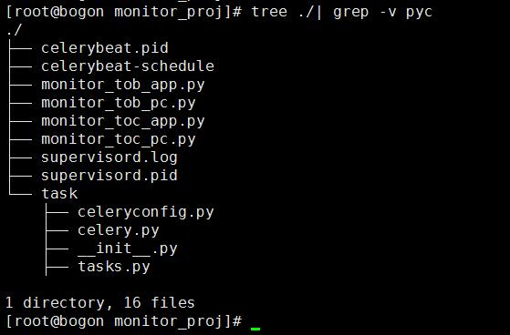
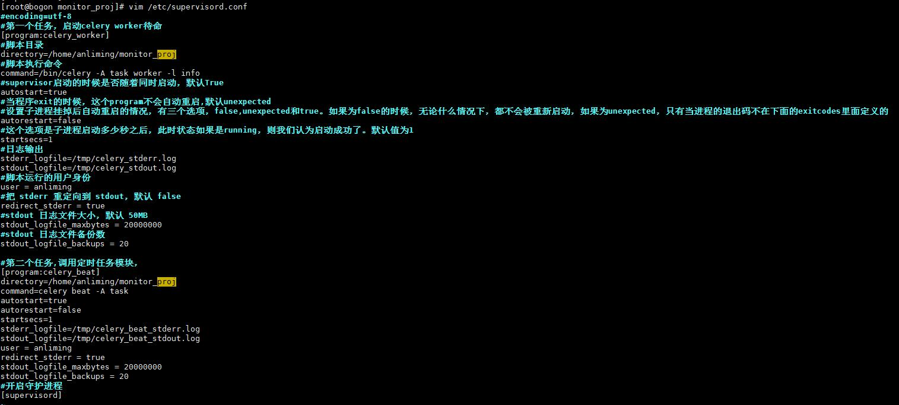

<!-- $theme: default -->

# 项目

* 当接口返回值和预期不一致时候，发送邮件报警

## 分析

  > * 访问普通界面（无需登录）时，获取返回值，使用json解析，如果能解析并达到自己设定的大小/条数，认为正常，如果不对就出发报警。
  > 
  >* 访问登录后的界面时，首先自动登录，获取session/cookie，带着session/cookie去访问，如果能解析并达到自己设定的大小/条数，认为正常，如果不对就出发报警。
  >
  >* 发送邮件的时候，使用异步发送，即主程序只执行触发发邮件的方法，具体发送邮件由异步调度软件去执行发邮件程序(主程序调celery的sendmail任务)。
  > 
  >* 每分钟轮训一遍所需访问的接口，用crontab或者celery的Schedule。  
## 项目组件
* 使用requests库模拟/发起请求，根据需要的URL决定使用GET/POST方法.[requests使用](http://docs.python-requests.org/zh_CN/latest/user/quickstart.html)
* 使用yagmail库发送邮件.  [使用yagmail发送邮件](https://www.jianshu.com/p/3d1f6cc65630?from=singlemessage)
* 使用celery 进行异步发送邮件和定时任务. [使用celery](https://zhuanlan.zhihu.com/p/22304455)
* 使用supervisor进行进程守护.[supervisor使用](https://www.jianshu.com/p/3658c963d28b)

## 代码结构

## 项目详解

1. Supervisor服务
supervisor配置文件监听了两个任务:
其一是celery worker，现将发送邮件的任务准备起来，待到主项目调用的时候，直接执行。supervisor监控到这个进程消失，会主动重启。
其二是celery beat，这个是调用定时任务的模块，supervisor监控到这个进程消失，会主动重启。
2. 配置文件

